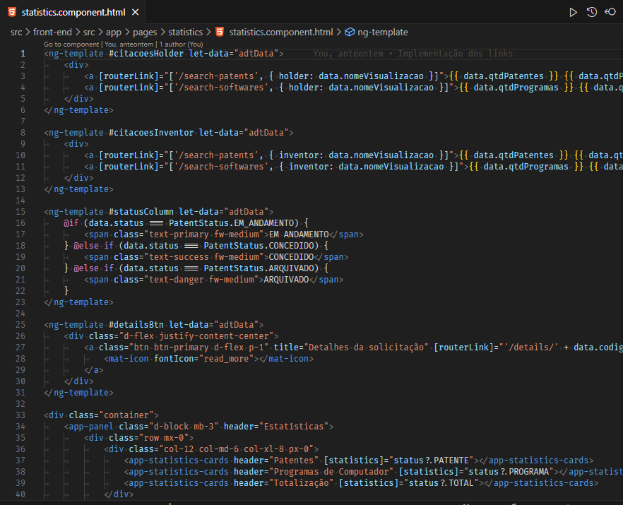
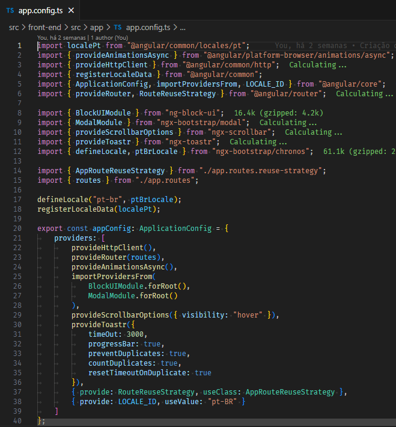

# Reivindicação das Atividades Complementares

## Utilização do Framework Bootstrap

Conforme pode ser visto na imagem acima, foi utilizado o framework de CSS Bootstrap para garantir a aplicação um visual moderno e mais responsivo.

Alguns exemplos de uso do Bootstrap exibidos na imagem acima são a utilização das seguintes classes:

- **text-primary**, **text-success** e **text-danger**: essas classes do bootstrap definem a cor do texto do elemento de acordo com o tema da aplicação;

- **d-flex** e **d-block**: essas classes definem o valor da propriedade `display` do elemento;

- **btn** e **btn-primary**: essas classes definem um componente com o visual de um botão do bootstrap;

- **row**, **col-12**, **col-md-6** e **col-xl-8**: essas classes definem a exibição de elementos em colunas de tamanho variável de acordo com o tamanho da tela do usuário por meio dos breakpoints (`xs`, `md`, `xl`) do bootstrap, o que é bastante útil para tornar a aplicação responsiva;

- **px-0**: essa classe remove o `padding` do elemento no eixo X, ou seja, tanto à esquerda quanto à direita.

## Utilização do Framework Angular

Na mesma imagem da seção anterior temos itens que comprovam a utilização do framework Angular que é muito útil no desenvolvimento de aplicações web.

Alguns itens da imagem anterior que comprovam a utilização do Angular são:

- A utilização do `routerLink` para definir o link de navegação entre as páginas ao invés de usar `href` (isso ocorre porque com Angular temos uma Single Page Application);

- A utilização de interpolação, denotada por chaves duplas `{{ ... }}`, para dinamicamente definir o conteúdo da página HTML;

- A utilização de instruções condicionais dentro do template por meio de blocos `@if (...) { ... } @else if (...) { ... }`;

- A utilização de componentes customizados, como o `app-statistics-card`.

Além disso, na imagem abaixo podemos ver como TypeScript é utilizado para configurar a aplicação Angular:

Observe que são importados e utilizados vários recursos do Angular, como o seu cliente HTTP e roteador de navegação.
